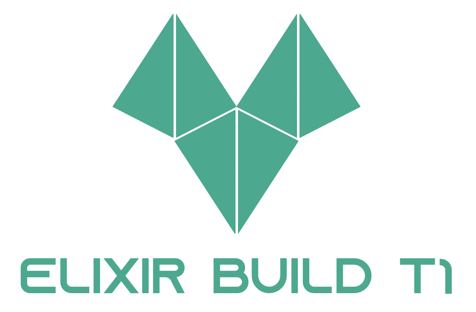

# ElixirEngine
A javascript library for making 2D games and physics. This library is specificaly for Vantage Games.

Developed and maintaned by Elixir Build

## New Stuff
### 1.1.1
- Minor: A new component called audio.
```js
// In the start function
music = new Audio("audio/a_sound.wav");
music.play();
```
- Patch: `Bounce` component deleted and added as a parameter in the Gravity Component.
```js
// New bounce parameter: Gravity(width, height, color, x, y, bounce)
Obj = new Gravity(30, 30, "black", 30, 30, 0.6);
```
- Patch: You now don't need to add a `GameArea` variable.


## How to use (Outdated)

Add an `onload="start()"` function we can create objects in the canvas.
Also, create a canvas with an id attribute.

`index.html`
```html
<html>
  <head>
    <script src="elixir-engine-one.js"></script>
    <script src="script.js"></script>
    <title>Document</title>
  </head>
  <body onload="start()">
    <!-- A canvas that you can play on -->
    <canvas id="world"></canvas>
  </body>
</html>
```

Then create a js file.
`script.js`
```js
// with this function we can style canvas
canvas("world", 0, 0, "darkslategray");

// add some objects
var Obj;
var Wall;
var WallRight;

function start() {
    Obj = new Bounce(30, 30, "white", 144, 0.1);
    Wall = new Gravity(10, 270, "black", 0.1, 1)
    WallRight = new Gravity(10, 270, "black", 990, 20)

    GameArea.start();
}

// modify the scene
var GameArea = {
    canvas: document.getElementById("world"),
    start: function () {
        this.canvas.width = 1000;
        this.canvas.height = 270;
        this.context = this.canvas.getContext("2d");
        document.body.insertBefore(this.canvas, document.body.childNodes[0]);
        this.interval = setInterval(updateGameArea, 20);

        window.addEventListener('keydown', function (e) {
            GameArea.keys = (GameArea.keys || []);
            GameArea.keys[e.keyCode] = (e.type == "keydown");
        })
        window.addEventListener('keyup', function (e) {
            GameArea.keys[e.keyCode] = (e.type == "keydown");
        })
    },
    stop: function () {
        clearInterval(this.interval);
    },
    clear: function () {
        this.context.clearRect(0, 0, this.canvas.width, this.canvas.height);
    }
}

// update the object's position
function updateGameArea() {
    GameArea.clear();
    Obj.newPos();
    Obj.update();

    Wall.newPos();
    Wall.update();

    WallRight.newPos();
    WallRight.update();
}
```

You can also use other components other than `bounce()`.

# Components
These components are for what type of object you want.
If you wanted a normal object you could just use the `Gravity()` function.
If you wanted a bouncy object you could just use `Bounce()`.
If you want a rotating/spinning object you can use `Rotate()`.


Normal Gravity
```js
Obj = new Gravity(30, 30, "white", 144, 0.1);
```

Rotate an object
```js
Obj = new Rotate(30, 30, "white", 144, 0.1);
```
But if you use the rotate component, the `updateGameArea` function will be different.
```js
function updateGameArea() {
    GameArea.clear();
    Obj.angle += 10 * Math.PI / 180;
    Obj.update();

    Wall.newPos();
    Wall.update();

    WallRight.newPos();
    WallRight.update();
}
```

The number before `Math.PI` is the speed.

## Credits
- Rogan Wido - Programmer
- Othnian Guzman - Assistant Programmer

## License
MIT
